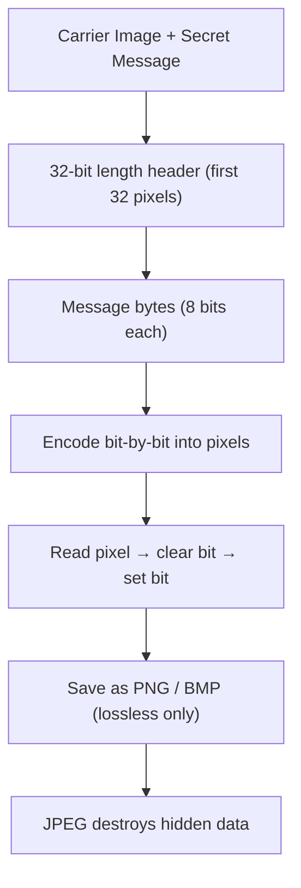

# Image Steganography (Java · OOP)

> **Hide secret text inside images** using Least Significant Bit (LSB) encoding — built in Java with a multi-window Swing desktop UI.

[](https://openjdk.org/)
[](https://docs.oracle.com/javase/tutorial/uiswing/)
[]()
[](LICENSE)


---

## What Is This?

Steganography hides data *inside* a carrier file so the file still looks completely normal. This project implements **spatial-domain LSB embedding** — each bit of a secret message silently overwrites the least significant bit of a pixel's color channel. The change is invisible to the human eye, but fully recoverable by the decoder.

The app walks through a **splash screen → main menu → encode / decode** workflow, each in its own Swing window.

---

## How It Works

### Encoding



### Decoding

1. Open the stego PNG or BMP
2. Read the 32-bit length header from the first 32 pixels
3. Extract exactly `length` bytes from the remaining pixels
4. Reconstruct and display the original message

### Capacity check

Before embedding, the encoder validates:

```
Required bits = (message length × 8) + 32
Available bits = image width × image height
```

If the message is too long for the carrier image, the user sees an error dialog — no silent corruption.

---

## Features

| | |
|---|---|
| Encode | Embed text into any carrier image with a live side-by-side preview (original vs. stego) |
| Decode | Recover hidden text from any losslessly-saved stego image |
| Capacity validation | Rejects messages that exceed available pixel bits before embedding |
| Length header | 32-bit prefix ensures the decoder reads exactly the right number of bytes |
| Format handling | Open any common format for encoding; enforce PNG/BMP on save |
| Desktop UX | Nimbus look-and-feel, splash screen with progress bar, keyboard mnemonics |
| Standalone classes | `Encryption` and `Decryption` each have their own `main` — run and test independently |

---

## Project Structure

```
Steganography-Java-OOP/
├── Main.java               # Entry point → launches SplashScreenFrame
├── SplashScreenFrame.java  # Threaded progress bar, transitions to MenuFrame
├── MenuFrame.java          # Navigation hub — Encode / Decode
├── Encryption.java         # Encode window: open image, embed, preview, save
├── Decryption.java         # Decode window: open stego image, extract message
└── Steganography.iml       # IntelliJ module descriptor
```

### Class responsibilities

| Class | Role |
|-------|------|
| `Main` | Boots `SplashScreenFrame` |
| `SplashScreenFrame` | Background thread drives progress bar; opens `MenuFrame` on complete |
| `MenuFrame` | Central hub; launches encode or decode window |
| `Encryption` | `JFrame` + `ActionListener` — full encode workflow + image preview |
| `Decryption` | `JFrame` + `ActionListener` — full decode workflow |

---

## Getting Started

**No external libraries** — standard JDK only (`javax.swing`, `java.awt`, `javax.imageio`).

### Prerequisites

- JDK 8 or later

### Run from the command line

```bash
# Compile
javac *.java

# Run (splash → menu → encode/decode)
java Main

# Or run encode/decode windows directly
java Encryption
java Decryption
```

### Run in IntelliJ IDEA

1. Open the folder as a project (uses `Steganography.iml`)
2. Confirm the JDK is set for the module
3. Run `Main.java`

> **Note:** The splash screen loads `images/stegno1.jpeg` from the classpath. If the image is missing, run `MenuFrame`, `Encryption`, or `Decryption` directly — all core functionality works without the splash asset.

---

## Usage

**Encode**
1. Launch → click **ENCODE**
2. Open a carrier image (JPG, PNG, BMP, GIF, TIFF)
3. Type your secret message
4. Click **Embed** — the side-by-side preview shows original vs. stego
5. Save as `.png` or `.bmp`

**Decode**
1. Launch → click **DECODE**
2. Open a stego `.png` or `.bmp`
3. Click **Decode** — the hidden message appears in the text area

---

## Skills Demonstrated

| Concept | Implementation |
|---------|----------------|
| OOP design | Separate classes for UI shell, navigation, encoding, and decoding — no logic leaking across concerns |
| Bitwise operations | `AND` / `OR` / `XOR` on raw `ARGB` pixel values to read and write individual bits |
| Java 2D & image I/O | `BufferedImage`, `ImageIO`, format-aware save filters |
| Event-driven GUI | Swing components, `ActionListener`, `JFileChooser`, `JSplitPane` |
| Concurrency basics | Background thread on splash screen prevents UI freeze during load |
| Defensive programming | Capacity validation, missing-image guards, wrong-format error dialogs |

---

## Technical Notes

- **Why PNG/BMP only for output?** Lossy formats like JPEG recompress pixel values on save — this destroys the embedded LSB data and makes decoding impossible. Lossless formats preserve every pixel exactly as written.
- **Security caveat:** This is educational steganography, not encryption. The message is hidden but not secured — anyone who knows to look for LSB-encoded data can extract it. For real confidentiality, encrypt with AES before embedding.
- **Pixel traversal:** Row-major order from a linear bit offset. Encoding and decoding use the same traversal so they stay in sync.

---

## Limitations

- Text-only payload (no binary file embedding in the UI)
- No password or encryption layer on the hidden message
- Capacity is proportional to image resolution — large messages need large carrier images
- Splash screen requires `images/stegno1.jpeg` on the classpath for the full startup experience

---

## Planned Improvements

- [ ] Shared `SteganographyUtils` class to eliminate duplicate bit logic between `Encryption` and `Decryption`
- [ ] Optional AES encryption layer before embedding
- [ ] Unit tests for bit-level helpers
- [ ] Binary file embedding (images, documents) in addition to text
- [ ] `src/main/resources/images/` layout for proper classpath asset management

---

